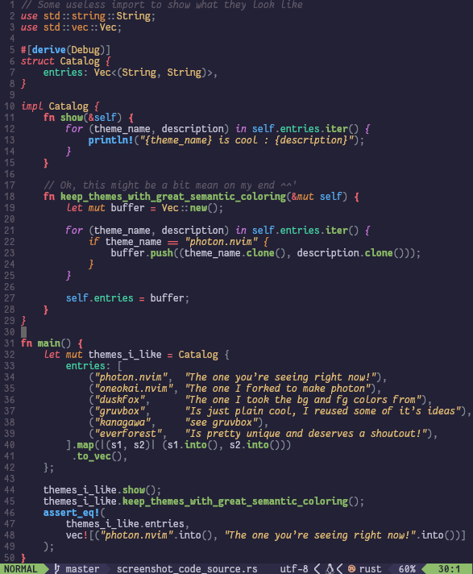

# photon.nvim

Photon.nvim (which has nothing to do with the archived
[photon.vim](https://github.com/axvr/photon.vim)) is a fork of
[Oneokai.nvim](https://github.com/AxelGard/oneokai.nvim), converted to be
closer to [Gruvbox](https://github.com/morhetz/gruvbox) and
[Duskfox](https://github.com/EdenEast/nightfox.nvim?tab=readme-ov-file#duskfox),
like a weird fusion of all of the things I love about those themes.

Since this is a fork, it should still have all the support for tree sitter and
highlighting. 
> For latest [TreeSitter](https://github.com/nvim-treesitter/nvim-treesitter)
> syntax highlight, upgraded to Neovim 0.8.0 or later built with tree-sitter
> 0.20.3+


<table>
<tr>
<td width="40%">  </td>
<td>

I spend *way too much* time trying to make my neovim environment as pretty as I
can, which lead me to make a somewhat custom theme (since I didn’t find one
that had *everything* I wanted). I forked oneokai since it was the closest to
what I wanted, but sprinkled in what I really loved from Duskfox (mainly it’s
background and text colors) and Gruvbox (for the choice of colors of some
elements, which I was used to).

Here’s two somewhat interesting things I love about this theme and haven’t seen many
others do :

1. using gradients (like `let mut`, `use namespace::type` or `for ... in
   self.item.method()` in rust, see screenshot), which make the theme really
   colorful and expressive without becomming an eye sore (*cough cough*
   dracula…), and is just neet !
2. cleanly separate loops (colored purple) and conditionals (colored orange)
   from other keywords (colored red), which (to me) helps understand the
   general code structure just by looking at the colors. Photon was made to
   present as much semantic information through the colors as possible (while
   staying pretty).

</td>
</tr>
</table>

## themes 

Right now there is just one theme, but I’ll *maybe* make a super dark and light
one in the future.

## install 

Install via package manager

```vim
" Using Vim-Plug
Plug 'Nuclear-Squid/photon.nvim'
```

or

```lua
-- Using Packer
use 'Nuclear-Squid/photon.nvim'
```

You can override the default values like so :

```lua
-- Lua
require('photon').setup {
    code_style = {
        strings = "none",
    },

    colors = {
        bg = "#222222",
    },

    highlights = {
        ["@include"] = { fmt = "bold" },
    } ,
}
require('photon').load()
```

## lualine 

Photon has lualine support

```lua
require('lualine').setup {
  options = {
    theme = 'photon',
    -- ... your lualine config
  }
}
```
